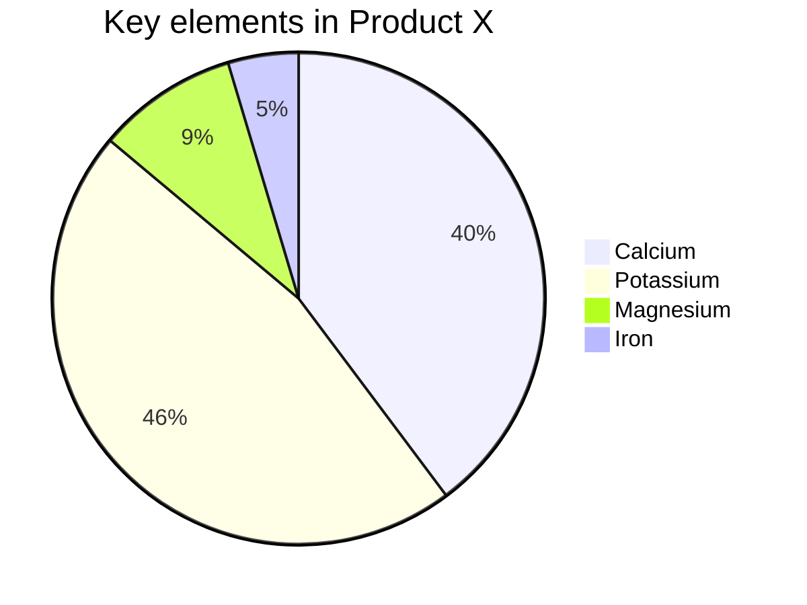

## Using the Default Editor


You can use the [editor on GitHub](https://github.com/dvasiliu/Example/edit/gh-pages/index.md) to maintain and preview the content for your website in Markdown files.

Whenever you commit to this repository, GitHub Pages will run [Jekyll](https://jekyllrb.com/) to rebuild the pages in your site, from the content in your Markdown files.

## Hello world!


### Markdown

Markdown is a lightweight and easy-to-use syntax for styling your writing. It includes conventions for

```markdown
Syntax highlighted code block

# Header 1
## Header 2
### Header 3

- Bulleted
- List

1. Numbered
2. List
...

**Bold** and _Italic_ and `Code` text
```

## **Math Equations**
%2B3%7D)


**Some Math**

^2) 


$$\Large x=\frac{-b\pm\sqrt{b^2-4ac}}{2a}$$

**The Cauchy-Schwarz Inequality**

$$\left( \sum_{k=1}^n a_k b_k \right)^2 \leq \left( \sum_{k=1}^n a_k^2 \right) \left( \sum_{k=1}^n b_k^2 \right)$$


## Python Code


import numpy as np
x = np.sqrt(2)


Other pages: <a href="Ex3.html">Ex3</a>

And one example from the class <a href="In_class_Example.html">In Class Example</a>

## Diagrams




For more details see [GitHub Flavored Markdown](https://guides.github.com/features/mastering-markdown/).


### Jekyll Themes

Your Pages site will use the layout and styles from the Jekyll theme you have selected in your [repository settings](https://github.com/dvasiliu/Example/settings). The name of this theme is saved in the Jekyll `_config.yml` configuration file.

### Support or Contact

Having trouble with Pages? Yes. Check out our [documentation](https://docs.github.com/categories/github-pages-basics/) or [contact support](https://support.github.com/contact) and we’ll help you sort it out.
